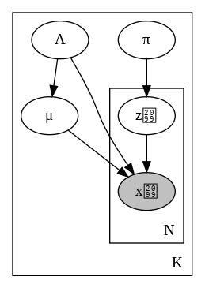
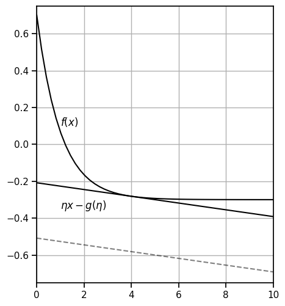
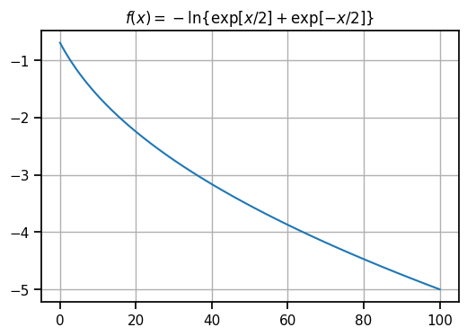
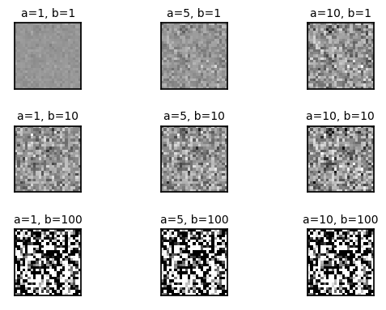
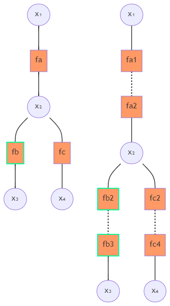

## 10.0 はじめに
パターン認識と機械学習の第10章「近似推論法」の解説資料です。各ノーテーションは本紙に従っています。

**確率モデルを適用するためにやること**は
1. 観測データ $\bold{X}$ が与えられたときの潜在変数 $\bold{Z}$ の事後分布 $p(\bold{Z}|\bold{X})$ を求める。
2. 事後分布 $p(\bold{Z}|\bold{X})$ を使って期待値を求める。
    - 計算不可能なことが多い。
        - 次元が高すぎたり、複雑で解析的に計算ができなかったりする。 
        - **近似法**を使う必要が出てくる。

近似法には**2種類**ある。
1. 決定的な方法（10章）
    - ラプラス近似や変分ベイズ、EP法など
2. 確率的な方法（11章）
    - MCMCなど

## 10.1 変分推論

起源は「解析学の変分法」
- 汎関数微分を使って汎関数の最大化（最小化）を達成する解を得る方法。
- 変分法から以下の分解が現れる。

EMアルゴリズム（9章）と同じような「**対数周辺分布**」の分解を考える。
$$
\ln p(\bold{X}) = \mathcal{L}(q) + \text{KL}(q\|p) \ge \mathcal{L}(q) \tag{10.2}
$$

$$
\begin{aligned}
    \text{where } \\ 
    \mathcal{L}(q) &= \int q(\bold{Z}) \ln \left\{\frac{p(\bold{X},\bold{Z})}{q(\bold{Z})}\right\} d\bold{Z} \\
    \text{KL}(q\|p) &= - \int q(\bold{Z}) \ln \left\{\frac{p(\bold{Z}|\bold{X})}{q(\bold{Z})}\right\} d\bold{Z}
\end{aligned}
$$

- ここで $q(\bold{Z})$ は**提案分布**。計算可能なもののうち柔軟なものを選ぶと良い。
- 下限（エビデンス下界、**ELBO**）となる $\mathcal{L}(q)$ を $q(\bold{Z})$ に関して最大化すると、$q(\bold{Z})$ は事後分布 $p(\bold{Z}|\bold{X})$ に近づく。
    - 任意の提案分布を使って良いなら、事後分布に一致させることができる。
    - 一般にそれは出来ないので、**十分良く近づけることが近似となる**。

> EMアルゴリズムと変分ベイズの違いは？  
> $\to$ EMアルゴリズムは「パラメーター $\theta$」の最適化を行う。変分ベイズは「提案分布 $q(\bold{Z})$」の最適化を行う。

### 10.1.1 分布の分解
**平均場近似**
- 潜在変数 $\bold{Z}$ を排反なグループ $\{\bold{Z}_i\}_{i=1}^{M}$ に分割する。
- 分布 $q(\bold{Z})$ がこれらで分解されると仮定する。
$$
q(\bold{Z}) = \prod_{i=1}^{M} q_i(\bold{Z}_i) \tag{10.5}
$$

この分解の1つ $\bold{Z}_j$ に着目して、$q_j = q_j(\bold{Z}_j)$ の最適化を目指す。ELBOを変形する。

$$
\begin{aligned} 
    \mathcal{L}(q) &= \int \prod_{i}q_i(\bold{Z}_i) \underbrace{\ln \left\{\frac{p(\bold{X},\bold{Z})}{\prod_{i}q_i(\bold{Z}_i)}\right\}}_{\hookrightarrow\text{対数の分解}} d\bold{Z} \\
    &= \int \prod_{i}q_i \ln p(\bold{X},\bold{Z}) d\bold{Z} - \int \prod_{i}q_i \left\{ \sum_{i} \ln q_i \right\} d\bold{Z} \\
    &= \int q_j \underbrace{\left\{ \int \ln p(\bold{X},\bold{Z}) \prod_{i\ne j} q_i d\bold{Z}_i \right\}}_{= \ \mathbb{E}_{i\ne j}[\ln p(\bold{X},\bold{Z})] \ = \ \ln\tilde{p}(\bold{X},\bold{Z}_j) + \text{const}} d\bold{Z}_j - \int q_j \ln q_j d\bold{Z_j} 
    + (q_j \ \mathsf{に依存しない項}) \\

    &= \int q_j \ln\tilde{p}(\bold{X},\bold{Z}_j) d\bold{Z}_j - \int q_j \ln q_j d\bold{Z_j} 
    + (q_j \ \mathsf{に依存しない項}) \\[1em]
    &= -\text{KL}(q_j\|\tilde{p}) 
    + (q_j \ \mathsf{に依存しない項}) \\
\end{aligned}
$$

したがって、**ELBOの最大化は $\text{KL}(q_j\|\tilde{p})$ の最小化と同値になる**ため、最適解は $q_j^* = \tilde{p}$ となる。  
以下の形を覚えておくと良い。
$$
\colorbox{lightyellow}{$ \ln q_j^*(\bold{Z}_j) = \mathbb{E}_{i\ne j}[\ln p(\bold{X},\bold{Z})] + \text{const} $} \tag{10.9}
$$

この式の右辺は $j$ 以外の因子 $q_i$ に依存しているので、完全な解析解ではない。  
よって、因子を**順に最適化する**必要がある。ELBOは各因子について凸なので収束は保証されている。

なお $q_j^*$ は確率分布なので、正規化して定数項を消せる。必要に応じてやればよい。
$$
q_j^*(\bold{Z}_j) = \frac{\exp[\mathbb{E}_{i\ne j}[\ln p(\bold{X},\bold{Z})]]}{\int \mathbb{E}_{i\ne j}[\ln p(\bold{X},\bold{Z})] d\bold{Z}_j}
$$

### 10.1.2 分解による近似のもつ性質
後回しにする。

### 10.1.3 例：一変数ガウス分布
ガウス-ガンマ共役事前分布とガウス尤度関数を用いたモデルを考える。

$$
\begin{aligned}
    &\text{Liklihood}: \\
    &\quad p(\{x_i\}_{i=1}^{N}|\mu, \tau) = \left(\frac{\tau}{2\pi}\right)^{N/2} \exp\left[-\frac{\tau}{2} \sum_{n=1}^N(x_n-\mu)^2\right] \\
    &\text{Prior}: \\
    &\quad p(\mu|\tau) = \mathcal{N}(\mu|\mu_0,(\lambda_0\tau)^{-1}) = \sqrt{\frac{\lambda_0\tau}{2\pi}} \exp\left[-\frac{\lambda_0\tau}{2} (\mu-\mu_0)^2\right]\\
    &\quad p(\tau) = \text{Gam}(\tau|a_0,b_0) = \frac{1}{\Gamma(a_0)}b_0^{a_0}\tau^{a_0-1} \exp[-b_0\tau]
\end{aligned}
$$

この場合の事後分布は厳密に求まるが、**あえて変分近似でやってみる**。  
提案分布を $q(\mu,\tau) = q_\mu(\mu) q_\tau(\tau)$ として、式 $\colorbox{lightyellow}{(10.9)}$ を適用する。
$$
\begin{aligned}
    \ln q_\mu^{*}(\mu) &= \mathbb{E}_{\tau}[\ln p(\{x_i\}|\mu, \tau) + \ln p(\mu|\tau) ] + \text{const} \\
    &= -\frac{\mathbb{E}[\tau]}{2} \left\{ \lambda_0(\mu-\mu_0)^2 + \sum_{n=1}^N(x_n-\mu)^2 \right\} + \text{const} \\
    &= -\frac{(\lambda_0+N)\mathbb{E}[\tau]}{2} \left\{ \mu^2 + \frac{2(\lambda_0\mu_0+\sum_n x_n)}{\lambda_0+N} \mu \right\} + \text{const} \\
    \therefore \ q_\mu^{*}(\mu) &= \mathcal{N}(\mu| \mu_N, \lambda_N^{-1}) \\[1em]
    \ln q_\tau^{*}(\tau) &= \mathbb{E}_{\mu}[\ln p(\{x_i\}|\mu, \tau) + \ln p(\mu|\tau) ] + \ln p(\tau) + \text{const} \\
    &= \left( a_0-1 + \frac{N+1}{2} \right) \ln\tau - \left\{ b_0 + \frac{1}{2} \mathbb{E}_{\mu}\left[\lambda_0(\mu-\mu_0)^2 + \sum_{n=1}^N(x_n-\mu)^2 \right] \right\} \tau + \text{const} \\
    \therefore \ q_\tau^{*}(\tau) &= \text{Gam}(\tau|a_N,b_N)
\end{aligned}
$$

このように、$q(\mu,\tau)$ の形を仮定しなくても、最適な関数形が尤度・事前分布から導かれる。

### 10.1.4 モデル比較
事前分布 $p(m)$ を持つ複数のモデルの候補を比較したいときもある。  
同時分布 $q(\bold{Z}, m)=q(\bold{Z}|m)q(m)$ の構造から、変分推論によって $q^*(m) \propto p(m) \exp\{\mathcal{L}_m\}$ となる。これを比較に用いられる。

## 10.2 例：変分混合ガウス分布 

    

上のようなモデルの同時分布は以下のようになる。ただし、$\bold{X} = \{\bold{x}_n\}_{n=1}^N, \bold{Z} = \{\bold{z}_n\}_{n=1}^N$ である。
$$
\begin{aligned}
    p(\bold{X}, \bold{Z}, \boldsymbol{\pi}, \boldsymbol{\mu}, \bold{\Lambda}) &= 
    p(\bold{X} | \bold{Z}, \boldsymbol{\mu}, \bold{\Lambda})
    p(\bold{Z}|\boldsymbol{\pi})
    p(\boldsymbol{\pi}) 
    p(\boldsymbol{\mu}|\bold{\Lambda}) 
    p(\bold{\Lambda}) \\[0.5em]
    &= \prod_{n=1}^N\prod_{k=1}^K\mathcal{N}(\bold{x}_n|\boldsymbol{\mu}_k, \bold{\Lambda}_k^{-1})^{z_{nk}} \cdot
    \prod_{n=1}^N\prod_{k=1}^K\pi_k^{z_{nk}} \\
    & \qquad \cdot \text{Dir}(\pi|\alpha_0) \cdot \prod_{k=1}^K \mathcal{N}(\boldsymbol{\mu}_k|\bold{m}_0, (\beta_0\bold{\Lambda}_k)^{-1}) \mathcal{W}(\bold{\Lambda}_k|\bold{W}_0,\nu_0) \tag{10.41}
\end{aligned}
$$

### 10.2.1 変分事後分布
同時分布 $(10.41)$ を $\bold{X}$ で周辺化した後、$q(\bold{Z}, \boldsymbol{\pi}, \boldsymbol{\mu}, \bold{\Lambda}) = q(\bold{Z})q(\boldsymbol{\pi}, \boldsymbol{\mu}, \bold{\Lambda})$ で近似しよう。  
式 $\colorbox{lightyellow}{(10.9)}$ を用いて

$$
\begin{aligned}
    \ln q^*(\bold{Z}) &= \mathbb{E}_{\boldsymbol{\pi}}[\ln p(\bold{Z}|\boldsymbol{\pi})] + \mathbb{E}_{\boldsymbol{\mu}, \bold{\Lambda}}[\ln p(\bold{X} | \bold{Z}, \boldsymbol{\mu}, \bold{\Lambda}) ] 
    + (\bold{Z} \ \mathsf{に依存しない項}) \\

    &= \sum_{n=1}^N \sum_{k=1}^K z_{nk} \ln \rho_{nk} 
    + (\bold{Z} \ \mathsf{に依存しない項}) \\
    \therefore \ q^*(\bold{Z}) &= \prod_{n=1}^K \prod_{k=1}^K \frac{\rho_{nk}}{\sum_k \rho_{nk}} = \prod_{n=1}^K \prod_{k=1}^K r_{nk}
\end{aligned}
$$

> $q^*(\bold{Z})$ が離散分布なら、$\mathbb{E}[z_{nk}]=r_{nk}$ となって負担率に相当する。また、$r_{nk}$ の更新はEMアルゴリズムのEステップと似ているため「変分Eステップ」と呼ばれる。

同様に

$$
\begin{aligned}
    \ln q^*(\boldsymbol{\pi}, \boldsymbol{\mu}, \bold{\Lambda}) &= \mathbb{E}_\bold{Z}[ \ln p(\bold{X} | \bold{Z}, \boldsymbol{\mu}, \bold{\Lambda})
    p(\bold{Z}|\boldsymbol{\pi}) p(\boldsymbol{\pi}) p(\boldsymbol{\mu}|\bold{\Lambda}) p(\bold{\Lambda})] 
    + (\boldsymbol{\pi}, \boldsymbol{\mu}, \bold{\Lambda} \ \mathsf{に依存しない項}) \\

    &= \colorbox{lightcyan}{$ \ln p(\boldsymbol{\pi}) + \mathbb{E}_\bold{Z}[\ln p(\bold{Z}|\boldsymbol{\pi})] $} +  \colorbox{beige}{$ \Sigma_k \ln p(\boldsymbol{\mu}_k|\bold{\Lambda}_k) p(\bold{\Lambda}_k) $} \\
    &\qquad \colorbox{beige}{$ + \Sigma_n \Sigma_k \mathbb{E}[z_{nk}] \ln \mathcal{N}(\bold{x}_n|\boldsymbol{\mu}_k,\bold{\Lambda}_k^{-1}) $} 
    + (\boldsymbol{\pi}, \boldsymbol{\mu}, \bold{\Lambda} \ \mathsf{に依存しない項})
\end{aligned}
$$

これを見ると、$q(\boldsymbol{\pi}, \boldsymbol{\mu}, \bold{\Lambda}) = q(\boldsymbol{\pi})\prod_k q(\boldsymbol{\mu}_k, \bold{\Lambda}_k)$ に分解できそうである。したがって、

$$
\begin{aligned}
    q^*(\boldsymbol{\pi}) &= \text{Dir}(\boldsymbol{\pi}|\boldsymbol{\alpha}) \\
    q^*(\boldsymbol{\mu}_k, \bold{\Lambda}_k) &= \mathcal{N}(\boldsymbol{\mu}_k|\bold{m}_k, (\beta_k\bold{\Lambda}_k)^{-1}) \mathcal{W}(\bold{\Lambda}_k|\bold{W}_k,\nu_k) 
\end{aligned}
$$

> EMアルゴリズムのMステップと似ているため「変分Mステップ」と呼ばれる。そのため、潜在変数モデルの変分推論は「変分EMアルゴリズム」とも呼ばれる。

- EMアルゴリズムと変分EMアルゴリズムの解法は非常に似ている。
    - 変分EMアルゴリズムは「縮退」と「過学習」が起こらない点で優れている。

### 10.2.2 変分下界
書き下すだけなので、省略する。

### 10.2.3 予測分布
新しい観測値 $\hat{\bold{x}}$ とその潜在変数 $\hat{\bold{z}}$ があるとき、予測分布はグラフィカルモデルから以下のように与えられる。

$$
\begin{aligned}
    p(\hat{\bold{x}}|\bold{X}) &= \sum_{\hat{\bold{z}}} \iiint p(\hat{\bold{x}}|\hat{\bold{z}}, \boldsymbol{\mu}, \bold{\Lambda}) p(\hat{\bold{z}}|\boldsymbol{\pi}) \colorbox{lavenderblush}{$ p(\boldsymbol{\pi}, \boldsymbol{\mu}, \bold{\Lambda}|\bold{X}) $} d\boldsymbol{\pi} d\boldsymbol{\mu} d\bold{\Lambda} \\
    &\simeq \sum_{\hat{\bold{z}}} \iiint p(\hat{\bold{x}}|\hat{\bold{z}}, \boldsymbol{\mu}, \bold{\Lambda}) p(\hat{\bold{z}}|\boldsymbol{\pi}) \colorbox{lavenderblush}{$ q^{*}(\boldsymbol{\pi}) q^{*}(\boldsymbol{\mu}_k, \boldsymbol{\Lambda}_k) $} d\boldsymbol{\pi} d\boldsymbol{\mu} d\bold{\Lambda} \\
    &= \frac{1}{\hat{\alpha}} \sum_{k=1}^K \alpha_k \text{St} (\hat{\bold{x}} | \bold{m}_k, \bold{L}_k, \nu_k+1-D)
\end{aligned}
$$

### 10.2.4 混合要素数の決定
違った $K$ の値を比べる場合、近似する関数形を変える可能性があるので注意が必要。

### 10.2.5 導出された分解
有効分離性から、あらかじめ提案分布の分解が可能である。  
$q(\bold{A},\bold{B},\bold{C})=q(\bold{A},\bold{B})q(\bold{C})$ の場合、**$\bold{A} \perp\!\!\!\!\perp \bold{B} | \bold{X}, \bold{C}$ ならば、$q^{*}(\bold{A},\bold{B}) = q^{*}(\bold{A}) q^{*}(\bold{B})$** となる。  
上の例でも、$\boldsymbol{\pi}$ と $\boldsymbol{\mu}, \bold{\Lambda}$ は head-to-tail で遮断される。

## 10.3 例：変分線形回帰
3.3 節のベイズ線形回帰モデルに変分ベイズを適用する。

$$
\begin{aligned}
    &\text{Liklihood}: \\
    &\quad p(\bold{t}|\bold{w}) = \prod_{n=1}^N \mathcal{N}(t_n|\bold{w}^\top \boldsymbol{\phi}_n, \beta^{-1}) \\
    &\text{Prior}: \\
    &\quad p(\bold{w}|\alpha) = \mathcal{N}(\bold{w}|\bold{0}, \alpha^{-1} \bold{I}) \\
    &\quad p(\alpha) = \text{Gam}(\alpha|a_0,b_0)
\end{aligned}
$$

### 10.3.1 変分分布
事後分布 $p(\bold{w},\alpha|\bold{t})$ を $q(\bold{w},\alpha) = q(\bold{w})q(\alpha)$ で近似する。  
例の如く、式 $\colorbox{lightyellow}{(10.9)}$ を適用すると、以下の結果を得る。
$$
\begin{aligned}
    q^{*}(\bold{w}) &= \mathcal{N}(\bold{w}|\bold{m}_N, \bold{S}_N) \\
    q^{*}(\alpha) &= \text{Gam}(\alpha|a_N,b_N)
\end{aligned}
$$

> なだらかな事前分布の極限 $a_0=b_0=0$ を考えると、$\mathbb{E}[\alpha] = a_N/b_N = M/\mathbb{E}[\bold{w}^\top\bold{w}] = M/[\bold{m}_N\bold{m}_N^\top+\bold{S}_N]$ となる。これは、エビデンス近似の結果 $(9.63)$ における $\alpha$ の点推定値に一致する。

### 10.3.2 予測分布
書き下すだけなので、省略する。

### 10.3.3 変分下界
書き下すだけなので、省略する。

## 10.4 指数型分布族
**指数型分布族における変分近似を考える**。  
ここでは、潜在変数 $\bold{Z}=\{\bold{z}_n\}$ と自然パラメーター $\boldsymbol{\eta}$ を明確に区別することにする。  
同時分布は、式 $(2.194)$ から次のようになる。

$$
p(\bold{X},\bold{Z}|\boldsymbol{\eta}) = \prod_{n=1}^M h(\bold{x}_n,\bold{z}_n) g(\boldsymbol{\eta}) \exp[\boldsymbol{\eta}^T\bold{u}(\bold{x}_n,\bold{z}_n)]
$$

この共役事前分布は、式 $(2.229)$ から次のようになる。
$$
p(\boldsymbol{\eta}|\nu_0,\boldsymbol{\chi}_0) = f(\nu_0,\boldsymbol{\chi}_0) g(\boldsymbol{\eta})^{\nu_0} \exp[\nu_0 \boldsymbol{\eta}^T \boldsymbol{\chi}_0]
$$

潜在変数と自然パラメーターの同時分布 $p(\bold{Z},\boldsymbol{\eta})$ を $q(\bold{Z},\boldsymbol{\eta})=q(\bold{Z})q(\boldsymbol{\eta})$ で近似しよう。  
式 $\colorbox{lightyellow}{(10.9)}$ を適用すると、以下の結果を得る。
$$
\begin{aligned}
    \ln q^*(\bold{Z}) &= \mathbb{E}_{\boldsymbol{\eta}}[\ln p(\bold{X},\bold{Z}|\boldsymbol{\eta})p(\boldsymbol{\eta}|\nu_0,\boldsymbol{\chi}_0)] + \text{const} \\
    &= \colorbox{lightcyan}{$ \mathbb{E}_{\boldsymbol{\eta}}[\ln p(\bold{X},\bold{Z}|\boldsymbol{\eta})]  $} + \text{const} \\
    &= \colorbox{lightcyan}{$ \sum_{n=1}^N \{\ln h(\bold{x}_n,\bold{z}_n) + \mathbb{E}_{\boldsymbol{\eta}}[\boldsymbol{\eta}^T]\bold{u}(\bold{x}_n,\bold{z}_n)\} $}  + \text{const} \\
    \therefore \ q^*(\bold{Z}) &= \prod_{n=1}^N q^*(\bold{z}_n) = \prod_{n=1}^N h(\bold{x}_n, \bold{z}_n) \underbrace{g(\mathbb{E}_{\boldsymbol{\eta}}[\boldsymbol{\eta}])}_{\text{正規化係数}} \exp[\mathbb{E}_{\boldsymbol{\eta}}[\boldsymbol{\eta}^T] \bold{u}(\bold{x}_n,\bold{z}_n)] \\
    \ln q^*(\boldsymbol{\eta}) &= \mathbb{E}_{\bold{Z}}[\ln p(\bold{X},\bold{Z}|\boldsymbol{\eta})p(\boldsymbol{\eta}|\nu_0,\boldsymbol{\chi}_0)] + \text{const} \\
    &= \colorbox{lightcyan}{$ \mathbb{E}_{\bold{Z}}[\ln p(\bold{X},\bold{Z}|\boldsymbol{\eta})] $} + \colorbox{beige}{$ \ln p(\boldsymbol{\eta}|\nu_0,\boldsymbol{\chi}_0) $} + \text{const} \\
    &= \colorbox{lightcyan}{$ \sum_{n=1}^N \{\ln g(\boldsymbol{\eta}) + \boldsymbol{\eta}^T\mathbb{E}_{\boldsymbol{z}_n}[\bold{u}(\bold{x}_n,\bold{z}_n)]\} $}  + \colorbox{beige}{$ \nu_0 \ln g(\boldsymbol{\eta}) + \nu_0 \boldsymbol{\eta}^\top\boldsymbol{\chi}_0 $} + \text{const} \\
    &= \underbrace{(\nu_0+N)}_{= \ \nu_N} \ln g(\boldsymbol{\eta}) + \boldsymbol{\eta}^\top \underbrace{\left(\nu_0 \boldsymbol{\chi}_0 + \sum_{n=1}^N \mathbb{E}_{\boldsymbol{z}_n}[\bold{u}(\bold{x}_n,\bold{z}_n)]\right)}_{= \ \nu_N \boldsymbol{\chi}_N} + \text{const} \\
    \therefore \ q^*(\boldsymbol{\eta}) &= \underbrace{f(\nu_N,\boldsymbol{\chi}_N)}_{\text{正規化定数}} g(\boldsymbol{\eta})^{\nu_N} \exp[\nu_N \boldsymbol{\eta}^T \boldsymbol{\chi}_N]
\end{aligned}
$$

> 変分Eステップ：十分統計量 $\bold{u}$ の潜在変数に関する期待値を計算し、自然パラメーターの分布を改良する。
> 変分Mステップ：自然パラメーター $\boldsymbol{\eta}$ の自然パラメーターに関する期待値を計算し、潜在変数の分布を改良する。

### 10.4.1 変分メッセージパッシング
同時分布 $p(\bold{x}) = \prod_i p(x_i | pa_i)$ の近似分布を $q(\bold{x})=\prod_i q(\bold{x}_i)$ とする。  
このとき、$q_j^{*}(\bold{x}_j)$ が依存する全てのノード集合は、ノード $\bold{x}_j$ のマルコフブランケットに対応する。  
$\rightarrow$ 因子の更新は局所的な計算になる。そのため、局所的なメッセージパッシングアルゴリズムを構築できる。

## 10.5 局所的変分推論法
全ての確率変数についての完全な事後分布の近似を求める「大域的」な方法ではなく、**各変数群に対する事後分布の近似を求める「局所的」な方法を考える**。  
今までの議論では、**対数関数の「凸性」がELBOの構成に重要であった**。

#### (A) 凸性とルジャンドル変換

下に凸な曲線 $y=f(x)$ の「接線」を $y = \eta x - g(\eta)$ と表すことにする。
ある $x$ での接線の $y$ 座標は、その点が接点となるときに最大化されるので
$$
f(x) = \max_{\eta}\{\eta x - g(\eta)\} \tag{10.130}
$$
となる。逆に、ある $\eta$ での切片 $-g(\eta)$ は、直線 $y = \eta x$ と $y = f(x)$ の最小値に設定すれば良いので、
$$
\begin{aligned}
    -g(\eta) &= \min_{x} \{f(x) - \eta x\} \\
    \therefore \ g(\eta) &= \max_x \{\eta x -f(x)\} \tag{10.129}
\end{aligned}

$$
となる。$(10.129),(10.130)$ を見れば、$f(x)$ と $g(\eta)$ が双対の関係（凸双対性）になっていることが分かる。また、この変換は**ルジャンドル変換**と呼ばれる。
この関係によって、**$f(x)$ の下界として $\eta x - g(\eta)$ を使うことができる**。

#### (B) ロジスティックシグモイドの下界
後に使うため、ロジスティックシグモイド $\sigma(x)$ の下界を求めておこう。

$$
\sigma(x) = \frac{1}{1+\exp[-x]}, \quad \ln \sigma(x) = x/2 \ \colorbox{lightcyan}{$ - \ln \{\exp[x/2] + \exp[-x/2]\} $}
$$

$f(x) = - \ln \{\exp[x/2] + \exp[-x/2]\}$ とおくと、これは **$x^2$ の凸関数**なので共役な関数 $g(\eta)$ が与えられる。

$$
g(\eta) = \max_{x}\{ \eta x^2 - f(\sqrt{x^2})\}
$$

微分して0になる停留点を $x=\xi$ とすれば

$$
\begin{aligned}
    \frac{d }{dx^2} \{ \eta x^2 - f(x)\} |_{x=\xi} = 0 &\iff \eta + \frac{1}{4\xi} \tanh\frac{\xi}{2} = 0 \\
    &\iff \eta = - \frac{1}{4\xi} \tanh\frac{\xi}{2} = - \underbrace{\frac{1}{2\xi} \left[\sigma(\xi)-\frac{1}{2}\right]}_{= \ \lambda(\xi) }
\end{aligned}
$$

となって、$f(x)$ の下界は $\eta=\lambda(\xi)$ で与えられる。

$$
f(x) \ge (-\lambda(\xi)) x^2 - g(\lambda(\xi)) = -\lambda(\xi) x^2 - \{ -\lambda(\xi) \xi^2 - f(\xi) \}
$$

したがって、**ロジステックシグモイド関数 $\sigma(x)$ の下界**は次となる。

$$
\begin{aligned}
    \sigma(x) &\ge \exp[ x/2 -\lambda(\xi) x^2 - \{ -\lambda(\xi) \xi^2 - f(\xi) \} ] \\
    &= \sigma(\xi) \exp[(x-\xi)/2 - \lambda(\xi) (x^2 - \xi^2) ] \tag{10.144}
\end{aligned}
$$

> $f(\xi) = \ln \sigma(\xi) -\xi/2$ を利用した。

#### (C) 下界の使い方
求めた下界 $\ell(a,\xi) \le \sigma(a)$ は次の積分で使える。

$$
I = \int \sigma(a) p(a) da \ge \int f(a, xi) p(a) da = F(\xi)
$$

$F(\xi)$ を最大化して得られる $F(\xi^*)$ はこの種類の中では最も厳しい下界であるが、一般には正確ではない。選んだ $\xi$ は $a$ に依存するため、ある $a$ の値でのみ正しいことになる。

## 10.6 変分ロジステック回帰
**局所的な変分推論**を適用することで、4章で用いたラプラス近似より高い精度を得ることができる。
$$
\begin{aligned}
    &p(\bold{t}|\bold{w}) = \prod_{n=1}^N p(t_n|\bold{w}) = \prod_{n=1}^N \sigma(a)^{t_n} \{1- \sigma(a)\}^{1-t_n} = \prod_{n=1}^N \exp[a t_n] \sigma(-a)\\
    &p(\bold{w}) = \mathcal{N}(\bold{w}|\bold{m}_0, \bold{S}_0) \\ 
\end{aligned}
$$

ただし $a = \bold{w}^T \phi_n$ とした。

### 10.6.1 変分事後分布
周辺尤度 $p(\bold{t})$ は次の形になる。
$$
p(\bold{t}) = \int p(\bold{t},\bold{w}) d\bold{w} = \int p(\bold{t}|\bold{w}) p(\bold{w}) d\bold{w}
$$

この積分は解析的に解けないので近似する。  
先の**ロジステックシグモイドの下限**を用いると、次のようになる。
$$
\begin{aligned}
    &p(\bold{t}|\bold{w}) p(\bold{w}) \ge h(\bold{w}, \boldsymbol{\xi}) p(\bold{w})  \tag{10.152} \\
    &\text{where } \ h(\bold{w}, \boldsymbol{\xi}) = \prod_{n=1}^N \exp[a t_n] \sigma(\xi_n) \exp[(-a-\xi_n)/2 - \lambda(\xi_n) (a^2-\xi_n^2)]
\end{aligned}
$$

さらに両辺対数をとると、次のようになる。
$$
\begin{aligned}
    \ln p(\bold{t}|\bold{w}) p(\bold{w}) &\ge \ln h(\bold{w}, \boldsymbol{\xi}) + \ln p(\bold{w}) \\
    &= \sum_{n=1}^N \{ a(t_n - 1/2) - \lambda(\xi_n) (a^2 - \xi_n^2) \}\\
    &\qquad - 1/2 (\bold{w}-\bold{m}_0)^\top \bold{S}_0^{-1} (\bold{w}-\bold{m}_0) + (\bold{w} \ \mathsf{に依存しない項}) \\
\end{aligned}
$$

$\bold{w}$ の1,2次の項を見ると、事後分布がガウス分布とわかる。
$$
q(\bold{w}) = \mathcal{N}(\bold{w}|\bold{m}_N, \bold{S}_N) \tag{10.156}
$$

### 10.6.2 変分パラメーターの最適化
したがって、周辺尤度の下限 $\mathcal{L}(\boldsymbol{\xi})$ が以下のようになる。このパラメーターを最適化する。
$$
\ln p(\bold{t}) \ge \ln \int h(\bold{w}, \boldsymbol{\xi}) p(\bold{w}) d\bold{w} = \mathcal{L}(\boldsymbol{\xi})
$$

#### (A) EMアルゴリズム
Eステップでは、$\boldsymbol{\xi}^{\text{old}}$ を使って $\bold{w}$ の事後分布 $(10.156)$ を計算する。

続くMステップでは、事後分布による期待値 $Q(\boldsymbol{\xi},\boldsymbol{\xi}^{\text{old}}) = \mathbb{E}_{\bold{w}}[\ln h(\bold{w}, \boldsymbol{\xi}) p(\bold{w})]$ の最大化を行う。

$$
Q(\boldsymbol{\xi},\boldsymbol{\xi}^{\text{old}}) = \sum_{n=1}^N \{ \ln \sigma(\xi_n) - \xi_n/2 - \lambda(\xi_n) ( \mathbb{E}_{\bold{w}}[a^2]- \xi_n^2 )\} + (\boldsymbol{\xi} \ \mathsf{に依存しない項})
$$

$Q$ の $\xi_n$ に関する微分を $0$ とおいて、$\xi_n$ の再推定方程式を得る。

$$
(\xi_n^{\text{new}})^2 =  \mathbb{E}_{\bold{w}}[a^2] = \bold{\phi}_n^\top (\bold{S}_N + \bold{m}_N\bold{m}_N^\top) \bold{\phi}_n
$$

#### (B) 変分近似
ELBOを書き下すと、次のようになる。
$$
\begin{aligned}
    \mathcal{L}(\boldsymbol{\xi}) &= \frac{1}{2} \ln \frac{|\bold{S}_N|}{|\bold{S}_0|} + \frac{1}{2} \bold{m}_N^\top \bold{S}_N^{-1} \bold{m}_N - \frac{1}{2} \bold{m}_0^\top \bold{S}_0^{-1} \bold{m}_0 + \sum_{n=1}^N \{ \ln \sigma(\xi_n) - \xi_n/2 + \lambda(\xi_n) \xi_n^2\} \\
    &= \frac{1}{2} \ln |\bold{S}_N| + + \frac{1}{2} \bold{m}_N^\top \bold{S}_N^{-1} \bold{m}_N  + \sum_{n=1}^N \{ \ln \sigma(\xi_n) - \xi_n/2 + \lambda(\xi_n) \xi_n^2\} + (\boldsymbol{\xi} \ \mathsf{に依存しない項})
\end{aligned}
$$

$\mathcal{L}(\boldsymbol{\xi})$ の $\xi_n$ に関する微分を $0$ とおいて、$\xi_n$ の再推定方程式を得る。
$$
(\xi_n^{\text{new}})^2 = \bold{\phi}_n^\top (\bold{S}_N + \bold{m}_N\bold{m}_N^\top) \bold{\phi}_n
$$

> EMアルゴリズムと全く同じ再推定方程式となる。予測分布はラプラス近似の場合と同じ形になる。

### 10.6.3 ハイパーパラメーターの推論
$p(\bold{w}|\alpha) = \mathcal{N}(\bold{w}|\bold{0}, \alpha^{-1} \bold{I})$ のように、事前分布にハイパーパラメーター $\alpha \sim \text{Gam}(a_0,b_0)$ を追加する。

この場合の同時分布 $p(\bold{w}, \alpha, \bold{t})$ を $q(\bold{w}, \alpha)$ で変分近似しよう。  
式 $(10.152)$ を用いて変分パラメーター $\boldsymbol{\xi}$ を導入する。

$$
\begin{aligned}
    \ln p(\bold{t}) &\ge \mathcal{L}(q) = \iint q(\bold{w}, \alpha) \ln \frac{p(\bold{w}, \alpha, \bold{t})}{q(\bold{w}, \alpha)} d\bold{w} d\alpha\\
    &\ge \iint q(\bold{w}, \alpha) \ln \frac{h(\bold{w}, \boldsymbol{\xi}) p(\bold{w}|\alpha) p(\alpha)}{q(\bold{w}, \alpha)} d\bold{w} d\alpha = \tilde{\mathcal{L}}(q, \boldsymbol{\xi})
\end{aligned}
$$

分解 $q(\bold{w}, \alpha) = q(\bold{w})q(\alpha)$ を行って、式 $\colorbox{lightyellow}{(10.9)}$ を適用する。

$$
q^*(\bold{w}) = \mathcal{N}(\bold{w}|\boldsymbol{\mu}_N, \bold{\Sigma}_N), \quad q^*(\alpha) = \text{Gam}(\alpha|a_N, b_N)
$$

変分パラメーター $\boldsymbol{\xi}$ は $\tilde{\mathcal{L}}(q, \boldsymbol{\xi})= \underbrace{\int q(\bold{w})\ln h(\bold{w},\boldsymbol{\xi})d\bold{w}}_{=\ \mathbb{E}_{\bold{w}}[h(\bold{w},\boldsymbol{\xi})]} + \text{const}$ を最大化して決定する。これはEMアルゴリズムのMステップと同じ計算になる。

$$
(\xi_n^{\text{new}})^2 = \bold{\phi}_n^\top (\bold{\Sigma}_N + \boldsymbol{\mu}_N\boldsymbol{\mu}_N^\top) \bold{\phi}_n
$$

## 10.7 EP法（期待値伝播法）
変分推論は $\text{KL}(q\|p)$ を $q$ に関して最小化する問題であった。**EP法は $\text{KL}(p\|q)$ を $q$ に関して最小化する問題である**。

$q(\bold{z})$ を指数型分布とし、KL情報量を自然パラメーター $\boldsymbol{\eta}$ の関数として考える。

$$
\begin{aligned}
    q(\bold{z}) &= h(\bold{z}) g(\boldsymbol{\eta}) \exp[\boldsymbol{\eta}^T\bold{u}(\bold{z})] \\
    \text{KL}(p\|q) &= - \int p(\bold{z}) \ln \frac{q(\bold{z})}{p(\bold{z})} d\bold{z} \\
    &= - \ln g(\boldsymbol{\eta}) - \boldsymbol{\eta}^T \mathbb{E}_{p(\bold{z})}[\bold{u}(\bold{z})] + (\boldsymbol{\eta} \ \mathsf{に依存しない項})
\end{aligned}
$$

このKL情報量の最小化は、勾配が $0$ になる点である。

$$
- \nabla \ln g(\boldsymbol{\eta}) = \mathbb{E}_{p(\bold{z})}[\bold{u}(\bold{z})]
$$

2章の式 $(2.226)$ で $\nabla \ln g(\boldsymbol{\eta})=-\mathbb{E}_{q(\bold{z})}[\bold{u}(\bold{z})]$ となることを示していたので、これを用いると次の式を得る。

$$
\mathbb{E}_{q(\bold{z})}[\bold{u}(\bold{z})]= \mathbb{E}_{p(\bold{z})}[\bold{u}(\bold{z})] \tag{10.187}
$$

これは、**十分統計量の期待値**の一致によって最適解が与えられることを示している。この方法を**モーメントマッチング**と呼ぶ。

$p(\mathcal{D}, \boldsymbol{\theta}) = \prod_{i} f_i (\boldsymbol{\theta} )$ という同時分布を考える。この場合、事後分布 $p(\boldsymbol{\theta}|\mathcal{D}) = \frac{p(\mathcal{D}, \boldsymbol{\theta})}{p(\mathcal{D})} = \frac{1}{p(\mathcal{D})} \prod_{i} f_i (\boldsymbol{\theta} )$ を $q(\boldsymbol{\theta})=\frac{1}{Z} \prod_{i} \tilde{f}_i (\boldsymbol{\theta} )$ で近似する方法を作成する。

EP法では、他の因子を考慮しつつ各因子 $f_i(\boldsymbol{\theta})$ を順に最適化する。以下 $f_i = f_i(\boldsymbol{\theta})$ と略記する。

$1.$ 全体の積 $q^{\text{new}}(\boldsymbol{\theta}) \propto \tilde{f}_j \prod_{i\ne j} \tilde{f}_i$ が $\hat{p}(\boldsymbol{\theta}) \propto f_j \prod_{i\ne j} \tilde{f}_i$ に近づくように $\tilde{f}_j$ を決めたい。

因子 $\tilde{f}_j$ を除いた分布 $q^{\backslash j}(\boldsymbol{\theta}) = \prod_{i\ne j} \tilde{f}_i$ を除算で求める。

$$
q^{\backslash j}(\boldsymbol{\theta})= \frac{q(\boldsymbol{\theta})}{\tilde{f}_j}
$$

$\hat{p}(\boldsymbol{\theta})$ を分布として求める。

$$
\hat{p}(\boldsymbol{\theta}) = \frac{1}{Z_j} f_j q^{\backslash j}(\boldsymbol{\theta}), \quad Z_j = \int f_j q^{\backslash j}(\boldsymbol{\theta}) d\boldsymbol{\theta}
$$

$2.$ $\text{KL}(\hat{p}(\boldsymbol{\theta})\|q^{\text{new}}(\boldsymbol{\theta}))$ の最小化によって、$\tilde{f}_j$ を最適化する。

最適解は $\hat{p}(\boldsymbol{\theta}) = q^{\text{new}}(\boldsymbol{\theta})$ のときなので、$\tilde{f}_j$ は以下のようになる。

$$
\tilde{f}_j = Z_j \frac{q^{\text{new}}(\boldsymbol{\theta})}{q^{\backslash j}(\boldsymbol{\theta})}
$$

> EP法はバッチ学習のアイデアとなる。欠点は「収束の保証がない」点と「複峰性分布には向かない」点である。

### 10.7.1 例：雑音データ問題

以下のノイズを含む混合ガウス分布から生成した観測データ $\mathcal{D} = \{\bold{x}_n\}_{n=1}^N$ に対して、EP法を適用しよう。

$$
\begin{aligned}
    &\begin{cases}
        p(\bold{x}|\boldsymbol{\theta}) = (1-w) \mathcal{N}(\bold{x} | \boldsymbol{\theta}, \bold{I}) + w \mathcal{N}(\bold{x} | \boldsymbol{0}, a\bold{I}) \\
        p(\boldsymbol{\theta}) = \mathcal{N}(\bold{x} | \boldsymbol{0}, b\bold{I}) 
    \end{cases} \\
    &p(\mathcal{D}, \boldsymbol{\theta}) = p(\boldsymbol{\theta}) \prod_{n=1}^N p(\bold{x}_n|\boldsymbol{\theta})
\end{aligned}
$$

まず因子を $f_0 = p(\boldsymbol{\theta}), f_n = p(\bold{x}_n|\boldsymbol{\theta})$ とする。

提案分布には指数型分布族から**等方ガウス分布 $q(\boldsymbol{\theta})=\mathcal{N}(\boldsymbol{\theta}|\bold{m},\nu\bold{I})$ を選ぶ**。$q(\boldsymbol{\theta}) \propto \prod_n \tilde{f}_n$ と分解するので、$\tilde{f}_n = s_n \mathcal{N}(\boldsymbol{\theta}|\bold{m}_n,\nu_n\bold{I})$ となる。

$1.$ 初期化
$$
\tilde{f}_0 = \tilde{f}_1 = \cdots = \tilde{f}_N = 1
$$

$2.$ $f_n$ の近似
$$
\begin{aligned}
    q^{\backslash n}(\boldsymbol{\theta}) &= \frac{q(\boldsymbol{\theta})}{\tilde{f}_n} \propto \mathcal{N}(\boldsymbol{\theta}|\bold{m}^{\backslash n},\nu^{\backslash n}\bold{I}) \\[1em]
    Z_n &= \int f_n q^{\backslash n}(\boldsymbol{\theta}) d\boldsymbol{\theta} = (1-w) \mathcal{N}(\boldsymbol{\theta}|\bold{m}^{\backslash n},(\nu^{\backslash n}+1)\bold{I}) + w \mathcal{N}(\bold{x} | \boldsymbol{0}, a\bold{I}) \\[1em]
    q^{\text{new}}(\boldsymbol{\theta}) &= \mathcal{N}(\boldsymbol{\theta}|\bold{m}^{\text{new}},\nu^{\text{new}}\bold{I})\\[1em]
    \tilde{f}_n &= Z_n \frac{q^{\text{new}}(\boldsymbol{\theta})}{q^{\backslash n}(\boldsymbol{\theta})} = s_n^{\text{new}} \mathcal{N}(\boldsymbol{\theta}|\bold{m}_n^{\text{new}},\nu_n^{\text{new}}\bold{I})
\end{aligned}
$$

$3.$ 収束まで繰り返す。

### 10.7.2 グラフィカルモデルとEP法
全ての因子に依存するわけでは無いならば、8章で導入した因子グラフを使うと良い。

$p(\bold{x}) = f_a(x_1, x_2)f_b(x_2, x_3)f_c(x_2, x_4)$ を $q(x) \propto \tilde{f}_a(x_1, x_2)\tilde{f}_b(x_2, x_3)\tilde{f}_c(x_2, x_4)$ で近似したい。

各因子に分解した近似を考えると、次のようになる。

$$
q(x) \propto \tilde{f}_{a1}(x_1)\tilde{f}_{a2}(x_2) \colorbox{oldlace}{$ \tilde{f}_{b2}(x_2)\tilde{f}_{b3}(x_3) $} \tilde{f}_{c2}(x_2)\tilde{f}_{c4}(x_4)
$$

ここでは試しに<strong>$\tilde{f}_{b2}\tilde{f}_{b3}$</strong>を改良する。

$$
q^{\backslash b} \propto \tilde{f}_{a1}\tilde{f}_{a2}\tilde{f}_{c2}\tilde{f}_{c4} \\
\hat{p} = q^{\backslash b} f_b(x_2, x_3) \\
q^{\text{new}} \propto \prod_{i=1}^N \hat{p}(x_i)
$$

$\text{KL}(\hat{p}\|q^{\text{new}})$ を最小化する手順は、以下のようにメッセージパッシングとして捉えられる。

$$
\tilde{f}_b (x_2, x_3) \propto \frac{q^{\text{new}}}{q^{\backslash b}} = \frac{\tilde{f}_{a1}\tilde{f}_{a2}\tilde{f}_{c2} \sum_{x_3}f_b \sum_{x_2} \{ f_b \tilde{f}_{a2} \tilde{f}_{c2} \} \tilde{f}_{c4}}{\tilde{f}_{a1}\tilde{f}_{a2}\tilde{f}_{c2}\tilde{f}_{c4}} = \underbrace{\sum_{x_3}f_b}_{\mu_{f_b\to x_2}} \underbrace{\sum_{x_2} \{ f_b \overbrace{\tilde{f}_{a2}}^{\mu_{f_a\to x_2}} \overbrace{\tilde{f}_{c2}}^{\mu_{f_c\to x_2}}\}}_{\mu_{f_b\to x_3}} 
$$

同様にして、一般的な因子グラフに応用できる。また、積和アルゴリズムは近似分布が完全に分解できるようなEP法の特別な場合と考えることができる。

### 10.1.2 分解による近似のもつ性質（再訪）
2変数のガウス分布を「変分ベイズ」と「EP法」で近似した場合を比べる。
- 変分ベイズ：事後分布を**コンパクトに近似しすぎる傾向**がある。
- EP法：事後分布を**大域的に近似しすぎる傾向**がある。

これは最小化するKL情報量の違いで理解できる。

||変分ベイズ|EP法|
|:-:|:-:|:-:|
|KL情報量|$\text{KL}(q\|p)=q(\ln q - \ln p)$|$\text{KL}(p\|q)=p(\ln p - \ln q)$|
|$q(\bold{Z})$ の特徴|$p(\bold{Z})$ が小さい領域を避ける|$p(\bold{Z})$ が非零の領域をカバー|
|多峰性分布を 単峰分布で近似|どれか1つの峰を近似する。|複数の峰を平均して近似する。|

これら2つのKL情報量は $\alpha$ ダイバージェンスの $\alpha\to\pm1$ の極限（m-ダイバージェンス、e-ダイバージェンス）に対応する。  
$\alpha\le-1$ については**ゼロ志向**となり、最も大きい峰を探して近似する。$\alpha\ge-1$ については**ゼロ回避**となり、複数の峰を一度にカバーして近似する。

$$
D_{\alpha}(q \| p) = \frac{4}{1-\alpha^2} \left\{ 1 - \int p(x)^{(1+\alpha)/2}q(x)^{(1-\alpha)/2} dx \right\}
$$

## Reference
- Bishop, Christopher M., 元田 浩, 栗田 多喜夫, 樋口 知之, 松本 裕治, 村田 昇, (2012), パターン認識と機械学習 : ベイズ理論による統計的予測, 丸善出版
- 須山 敦志, (2019), ベイズ深層学習, 講談社, MLP機械学習プロフェッショナルシリーズ
- 藤原 彰夫, (2015), 情報幾何学の基礎―情報の内的構造を捉える新たな地平― , 牧野書店
- 赤穂 昭太郎, 情報幾何と機械学習, 計測と制御, 2005, 44 巻, 5 号, p. 299-306, 公開日 2009/11/26, Online ISSN 1883-8170, Print ISSN 0453-4662, https://doi.org/10.11499/sicejl1962.44.299
- [ルジャンドル変換の意味と具体例 | 高校数学の美しい物語](https://manabitimes.jp/math/1179)
- [変分ベイズ学習の理論](http://watanabe-www.math.dis.titech.ac.jp/users/swatanab/vbtheory.html)