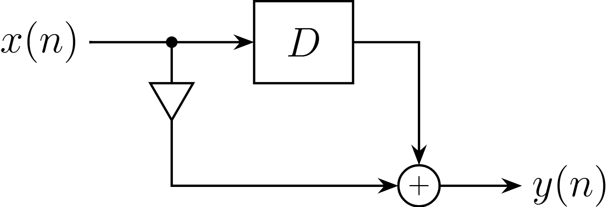
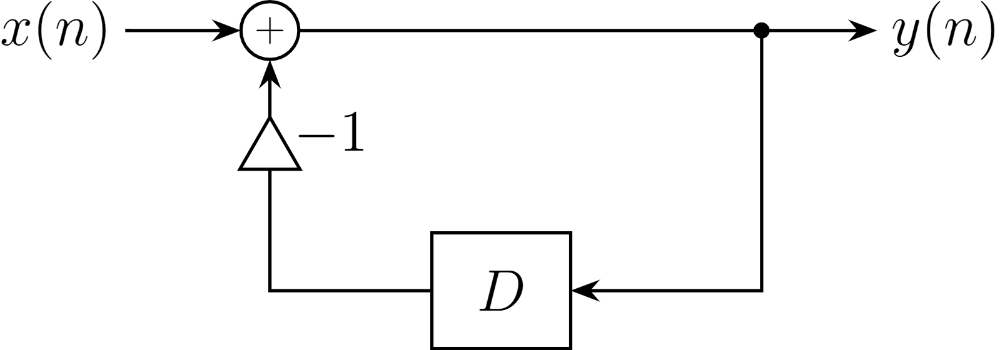
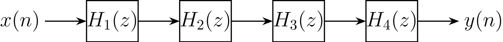
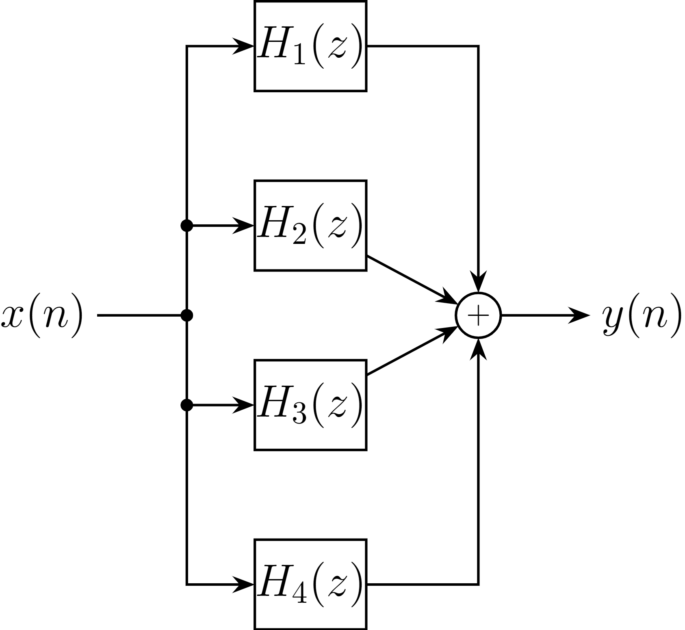
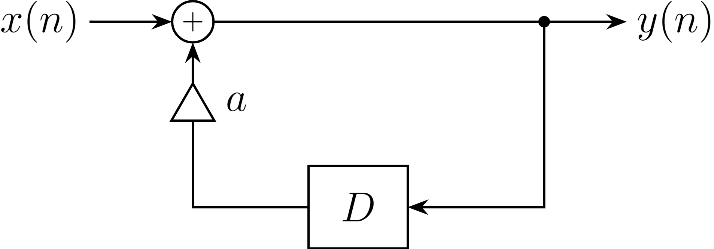

## 5.1 伝達関数の定義
今まで通り**線形時不変システム**を考える。

インパルス応答 $h(n)$ の $z$ 変換を $H(z)$ とすると、たたみこみに対する $z$ 変換の性質より次式が成立する。

$$
y(n) = h(n) * x(n) \ \underset{\mathcal{Z}^{-1}}{\overset{\mathcal{Z}}{\rightleftarrows}} \ Y(n) = H(z) X(z) 
$$

この式において、$H(z)$ をシステムの**伝達関数**という。$h(n)$ を $z$ 変換する他に、差分方程式を $z$ 変換しても求められる。

$$
H(z) = \sum_{n=0}^\infty h(n) z^{-n} = \frac{Y(z)}{X(z)}
$$

#### 例 1
1. $h(n)=2\delta(n) + 3\delta(n-1) - \delta(n-2)$ のとき。   
$\mathcal{Z}[\delta(n)]=1$ だから
$$
H(z) = \mathcal{Z}[h(n)] = 2 + 3z^{-1} - z^{-2}
$$

2. $y(n)=-x(n) + 2x(n-1) - 3x(n-2)$ のとき。  
$Y(z) = -X(z) + 2X(z)z^{-1} + 3X(z)z^{-2}$ だから
$$
H(z) = \frac{Y(z)}{X(z)} = -1 +2z^{-1} + 3z^{-2}
$$

 

さらに、**伝達関数からシステムを同定できる**。

#### 例 2
1. $H(z) = 2 + z^{-1}$ のとき。   
$Y(z) = 2X(z) + X(z)z^{-1}$ だから
$$
y(n) = 2x(n) + x(n-1)
$$

    

1. $H(z) = 1 / (1 + z^{-1})$ のとき。   
$Y(z) = X(z) - Y(z)z^{-1}$ だから
$$
y(n) = x(n) - y(n-1)
$$

    

 

## 5.2 縦続（じゅうぞく）システムと並列システムの伝達関数
$K$ 個のシステムの接続方法で呼び方が変わる。

- **縦続システム**：$H(z)=H_1(z)H_2(z) \cdots H_K(z)$
    - $H_k = output_k / output_{k-1}$ となっている。
- **並列システム**：$H(z)=H_1(z) + H_2(z) + \cdots + H_K(z)$
    - $H_k = output_k / input$ となっている。

よって、伝達関数を分解してシステムの構成を判断できる。

    
    
縦続システム

    
    
並列システム

## 5.3 伝達関数を用いた出力信号の計算法
逆に、伝達関数 $H(z)$ と入力信号の $z$ 変換 $X(z)$ が分かっていれば、出力信号を求められる。

$$
y(n) = \mathcal{Z}^{-1}[H(z)X(z)]
$$

#### 例 3
伝達関数が

$$
H(z)=\frac{\sqrt{2}z^{-1}}{1-\sqrt{2}z^{-1}+z^{-2}}
$$

のとき、インパルス応答（= 単位インパルス信号を入力したときの出力）を求める。

$$
\begin{aligned}
    h(n) &= \mathcal{Z}^{-1}[H(z)\mathcal{Z}[\delta(n)]]= \mathcal{Z}^{-1}[H(z)]\\[0.5em]
    &=\mathcal{Z}^{-1}\left[\frac{2\sin(\pi/4)z^{-1}}{1-2\cos(\pi/4)z^{-1}+z^{-2}}\right] \\[1em]
    &= 2 u(n) \sin\left(\frac{\pi n}{4}\right)
\end{aligned}
$$

したがって、離散時間の正弦波が発生する。

 

## 5.4 システムの安定性と極
任意の有界な入力信号 $x(n)$ に対して出力信号 $y(n)$ が有界なシステムを**安定なシステム**という。
- **有界**：信号 $x(n)$ が任意の $n$ に対して $|x(n)|\lt\infty$ であること。

システムが安定であるか判断するには、**インパルス応答をみればよい**。

$$
\sum_{n=-\infty}^\infty |h(n)| \lt \infty
$$

#### 例 4
差分方程式が

$$
y(n) = x(n) + ay(n-1)
$$

    

のとき、システムが安定であるための $a$ の条件を求める。

$$
\begin{aligned}
    h(n) &= \mathcal{Z}^{-1}[H(z)] =\mathcal{Z}^{-1}\left[\frac{1}{1-az^{-1}}\right] = a^n u(n)
\end{aligned}
$$

であるから、求める $a$ の条件は

$$
\sum_{n=-\infty}^\infty |a^n u(n)| = \sum_{n=0}^\infty |a|^n \lt \infty
$$

したがって、$|a| \lt 1$ のときは安定である。

 

システムが次のような差分方程式

$$
y(n) = \sum_{k=0}^{L-1} a_k x(n-k) + \sum_{k=1}^M b_k y(n-k)
$$

で書けるとき、伝達関数は次のようになる。

$$
H(z) = \frac{\sum_{k=0}^{L-1} a_kz^{-k}}{1-\sum_{k=1}^M b_k z^{-k}} = \frac{N(z)}{D(z)}
$$

ここで $N(z), D(z)$ はそれぞれ分子多項式、分母多項式である。分子多項式 $N(z)=0$ の解は零点であり、$D(z)=0$ の解は極である。
- **零点**：$H(z)=0$ のときの $z$ のこと。
- **極**：$|H(z)|=\infty$ のときの $z$ のこと。

$N(z)=0$ の解を $\{q_k\}$、 $D(z)=0$ の解を $\{p_k\}$とおいて因数分解できる。

$$
\begin{aligned}
    N(z) &= H_0 \prod_{k=1}^L (1-q_kz^{-1}) = H_0 (1-q_1z^{-1})(1-q_2 z^{-1}) \cdots (1-q_L z^{-1})  \\
    D(z) &= \prod_{k=1}^M (1-p_kz^{-1}) = (1-p_1z^{-1})(1-p_2 z^{-1}) \cdots (1-p_M z^{-1})
\end{aligned}

$$

> 代数学の基本定理（[参考](https://mathtrain.jp/algebrabasic)）から分かる。

この表記では、伝達関数は次のように書ける。これは、L+M 個のシステムの縦続接続である。

$$
H(z) = \prod_{k=1}^M \frac{1}{1-p_k1z^{-1}} \cdot H_0 \prod_{k=1}^L (1-q_kz^{-1}) = \prod_{k=1}^M H_{k}^{(p)}(z) \cdot H_0 \prod_{k=1}^L H_{k}^{(q)}(z)
$$

縦続システムを構成する個々のシステムに1つでも不安定なシステムがあると全体が不安定になる。  
したがって、**システム全体が安定であるための条件**は、**極に帰着**して

$$
|p_k| \lt 1 \quad (k=1,\dots,M)
$$

となる。これは、**全ての極が複素数平面上の単位円内に存在すること**を示している。

## 5.5 コーヒーブレイク ☕
遅延波の除去は、遅延波の除去システム $H'(z)$ を組み込めば良い。

$$
X(z) = H'(z)Y(z) = H'(z)H(z)X(z)
$$

となるためには

$$
H'(z) = \frac{1}{H(z)}
$$

とすればよい。

#### 例 5
以下の状況を考える。

$$
\begin{cases}
    x(n) = \delta(n) + 2\delta(n-1) + 3\delta(n-2) \\
    h(n) = \delta(n) + 0.5\delta(n-1) \\
\end{cases}\\[1em]
y(n) = h(n) * x(n) = \delta(n) + 2.5\delta(n-1) + 4\delta(n-2) + 1.5\delta(n-3)
$$

遅延波の除去システムは

$$
H'(z) = \frac{1}{H(z)}= \frac{1}{1+0.5z^{-1}}
$$

とすれば、出力が復元できる。

$$
\begin{aligned}
    x'(n) &= \mathcal{Z}^{-1}[H'(z)Y(z)] \\[0.5em]
    &=\mathcal{Z}^{-1}\left[\frac{1+2.5z^{-1}+4z^{-2}+1.5z^{-3}}{1+0.5z^{-1}}\right] \\[1em]
    &=\mathcal{Z}^{-1}\left[1+2z^{-1} +3z^{-2}\right] \\[0.5em]
    &= \delta(n) + 2\delta(n-1) + 3\delta(n-2)
\end{aligned}
$$

> 割り算の中で遅延波を順に除去している。畳み込んだ分を除去しているだけ。

 

## Reference
- 太田正哉著 『例解 ディジタル信号処理入門』 コロナ社 2013年10月