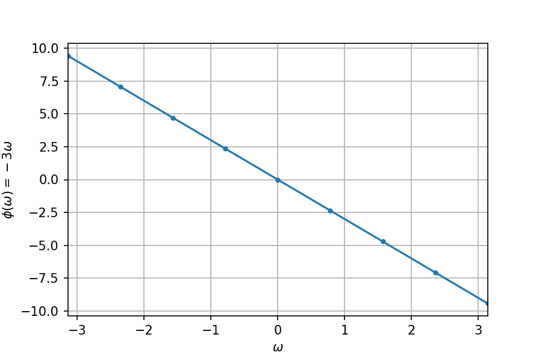
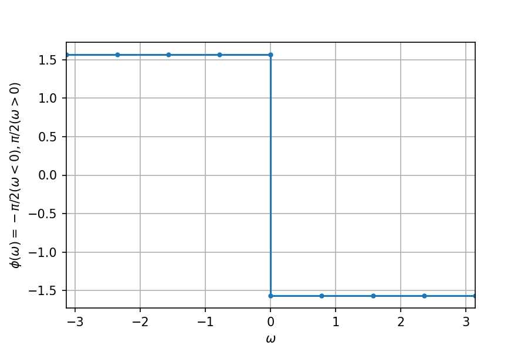
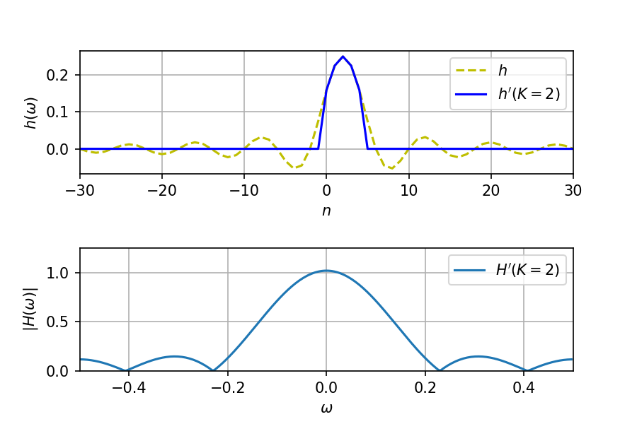
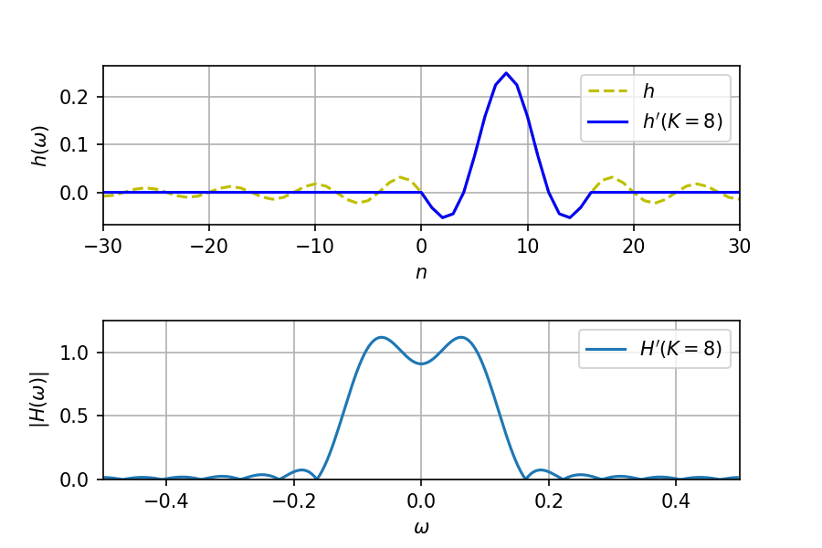
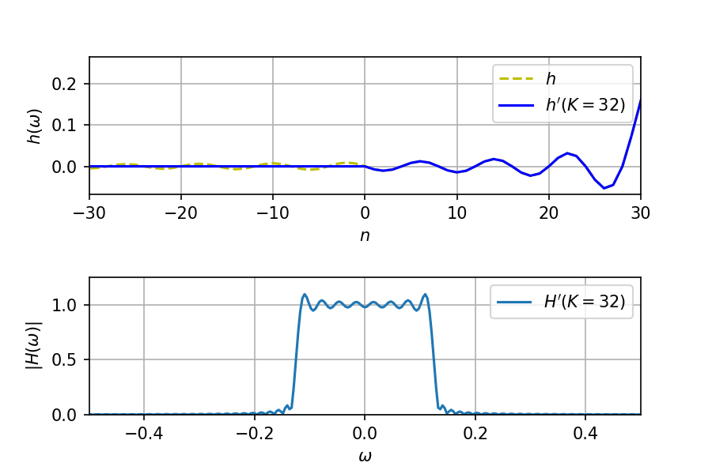

## 8.1 離散時間システムの周波数特性
インパルス応答が $h(n)$ のシステムに、複素正弦波 $x(n)=e^{j\omega n}$ を入力したときの出力は

$$
\begin{aligned}
  y(n) &= h(n) * x(n) = \sum_{k=-\infty}^{\infty} h(k) e^{j \omega(n-k)} \\
  &= \underbrace{\sum_{k=-\infty}^{\infty} h(k) e^{-j \omega k}}_{H(e^{j \omega})} e^{j \omega n} = H(e^{j \omega}) e^{j \omega n} = H(e^{j \omega}) x(n)
\end{aligned}
$$

となる。ここで、$H(e^{j \omega})=|H(e^{j \omega})|e^{j \arg[H(e^{j \omega})]} = M(\omega) e^{j\phi(\omega)}$ とおくと、次のように書ける。

$$
y(n) = H(e^{j \omega}) x(n) = M(\omega) e^{j\phi(\omega)} e^{j\omega n} = M(\omega) e^{j(\omega n +\phi(\omega))}
$$

- 出力は**同じ周波数** $\omega$ の複素正弦波。
- **振幅**は $M(\omega)$ 倍される。
- **位相**は $\phi(\omega)$ 進む。

$$
\downarrow \text{したがって}
$$

- システムの**周波数特性**：$H(e^{j \omega})$
- システムの**振幅特性**：$M(\omega)$
- システムの**位相特性**：$\phi(\omega)$

これらを知ると、あらゆる信号がシステムでどのように変化するか分かる。

#### 例 1 周波数特性
1. $y(n)=x(n) + x(n-1)$ のとき。$\\[0.5em]$
$h(n) = \begin{cases} 1 & (n = 0,1) \\ 0 &(\text{otherwise})\end{cases}$ なので、  
次式から振幅特性は $2|\cos(\omega/2)|$ で、位相特性は $-\omega/2$ となる。

$$
\begin{aligned}
  H(e^{j \omega}) &= \sum_{k=-\infty}^{\infty} h(k) e^{-j \omega k} = 1 + e^{-j\omega} \\
  &= (e^{j\omega/2}+ e^{-j\omega/2}) e^{-j\omega/2} = 2\cos(\omega/2) e^{-j\omega/2}
\end{aligned}
$$

2. $h(n)=\sum_{k=0}^{N-1}\delta(n-k)$ のとき。$\\[0.5em]$
$h(n) = \begin{cases} 1 & (n = 0,\dots,N-1) \\ 0 &(\text{otherwise})\end{cases}$ なので、  
次式から振幅特性は $\sin(\omega N/2)/\sin(\omega /2)$ で、位相特性は $-\omega(N-1)/2$ となる。

$$
\begin{aligned}
  H(e^{j \omega}) &= \sum_{k=-\infty}^{\infty} h(k) e^{-j \omega k} = \sum_{k=0}^{N-1} e^{-j \omega k}　\\
  &= \frac{1-e^{-j\omega N}}{1-e^{-j\omega}} = \frac{(e^{j\omega N/2}-e^{-j\omega N/2})e^{-j\omega N/2}}{(e^{j\omega /2}-e^{-j\omega /2})e^{-j\omega /2}} = \frac{\sin(\omega N/2)}{\sin(\omega /2)} e^{-j\omega(N-1)/2}
\end{aligned}
$$

 

> インパルス応答が実数のシステムでは、周波数特性の共役が次のようになる。
>$$
>\begin{aligned}
>  M(\omega) e^{j\phi(\omega)} &= \sum_{k=-\infty}^{\infty} h(k) e^{-j\omega k} \\[1em]
>  \overline{M(\omega) e^{j\phi(\omega)}} &= \sum_{k=-\infty}^{\infty} \overline{h(k) e^{-j\omega k}} = \sum_{k=-\infty}^{\infty} h(k) e^{j\omega k} \\
>\end{aligned}
>$$
>ここで、実数の正弦波 $x(n)=\cos(\omega n)=(e^{j\omega n} + e^{-j\omega n})/2$ を入力すると、
>$$
>\begin{aligned}
>  y(n) &= h(n) * x(n) = \sum_{k=-\infty}^{\infty} h(k) (e^{j\omega (n-k)} + e^{-j\omega (n-k)})/2 \\
>  &= (e^{j\omega n}/2) \sum_{k=-\infty}^{\infty} h(k) e^{-j\omega k} + (e^{-j\omega n}/2) \sum_{k=-\infty}^{\infty} h(k) e^{j\omega k} \\
>  &= (e^{j\omega n}/2) M(\omega) e^{j\phi(\omega)} + (e^{-j\omega n}/2) M(\omega) e^{-j\phi(\omega)} \\
>  &= M(\omega) \cos(\omega n + \phi(\omega))
>\end{aligned}
>$$
>となって、振幅が $M(\omega)$ 倍、位相が $\phi(\omega)$ 進む。つまり、**実数の正弦波でも、インパルス応答が実数ならば、前述の議論が適応できる。**

## 8.2 伝達関数と周波数特性
伝達関数の $z$ に $e^{j\omega}$ を代入すれば周波数特性が得られる。

$$
H(e^{j\omega n}) = H(z)|_{z=e^{j\omega}}
$$

## 8.3 フーリエ変換と周波数特性
インパルス応答を離散時間フーリエ変換すると周波数特性が得られる。

$$
H(e^{j\omega n}) = \mathcal{F}[h(n)]
$$

フーリエ変換の性質から次が使える。
- $|Y(e^{j\omega n})| = |H(e^{j\omega n})||X(e^{j\omega n})|$
- $\arg [Y(e^{j\omega n})] = \arg [H(e^{j\omega n})] + \arg [X(e^{j\omega n})]$

#### 例 2 位相特性
1. **直線位相特性**
$$
\phi(\omega) = a \omega, \quad y(n) = M(\omega) e^{j\omega(n +a)}
$$

    

- 入力と出力が同じ波形となる。
- 直線位相フィルタは、信号波形を変化させない。

2. **ヒルベルト変換器**
$$
\phi(w) = \begin{cases}
  -\pi/2 &(\omega \lt 0) \\
  \pi/2 &(\omega \gt 0)
\end{cases} \\[1em]
\begin{aligned}
  z(n) &= x(n) + jy(n) \\
  &= A(n) \cos(\varphi(n))  + j A(n) \sin(\varphi(n)) \\
  &= A(n) e^{j \varphi(n)} \\
\end{aligned}
$$

    

- $90\degree$ シフトさせて $\cos(\theta) \leftrightarrows \sin(\theta)$ の変換をする。
- 実信号 $x(n)$ を複素信号 $z(n)$ にして、実信号の振幅 $A(n)$ と位相 $\varphi(n)$ を同時に求めることができる。

> [参考：ヒルベルト変換と解析信号](https://www.onosokki.co.jp/HP-WK/eMM_back/emm180.pdf)

 

## 8.4 デジタルフィルタ
必要な周波数を抽出するシステムを**デジタルフィルタ**という。信号を通す周波数帯を**通過域**、遮断する周波数帯を**阻止域**、その間を**過渡域**という。

- ローパスフィルタ (LPF)
- ハイパスフィルタ (HPF)
- バンドパスフィルタ (BPF)
- バンドストップフィルタ (BSF)

**FIRフィルタ**と**IIRフィルタ**がある。

||FIRフィルタ|IIRフィルタ|
|:-:|:-:|:-:|
|安定性|つねに安定|注意が必要|
|直線位相特性|可能|困難|
|タップ数|多い|少ない|
 

周波数特性からインパルス応答を求めてシステムを設計する。

#### 例 3 ローパスフィルタの設計
$$
H(e^{j\omega}) = \begin{cases}
  e^{-j\omega K} & (|\omega| \le \omega_c) \\
  0 & (|\omega| \gt \omega_c)
\end{cases}
$$

という理想的な周波数特性からインパルス応答を求める。

$$
h(n) = \mathcal{F}^{-1}[H(e^{j\omega})] = \frac{1}{2\pi}\int_{-\omega_c}^{\omega_c} e^{-j\omega (n-K)} d\omega = \frac{\omega_c}{\pi} \text{sinc}(\omega_c(n-K))
$$

このインパルス応答は無限に続くため、物理的に実装が難しい。切り出すことでFIRフィルタとする。

$$
h'(n) = \begin{cases}
  h(n) & (0 \le n \le 2K) \\
  0 & (n \lt 0, \ 2K \lt n)
\end{cases}
$$

    

    

    

 

> Notebook: [colaboratory link](https://colab.research.google.com/github/sn0422j/notebook/blob/master/DigitalProcess.ipynb?hl=ja)

## Reference
- 太田正哉著 『例解 ディジタル信号処理入門』 コロナ社 2013年10月